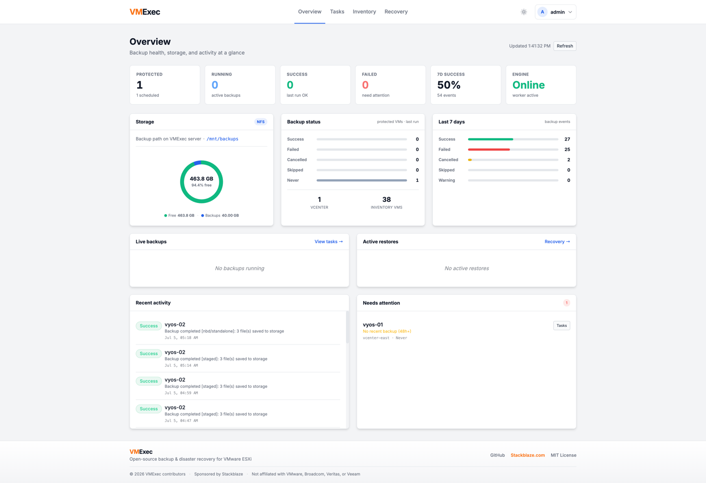
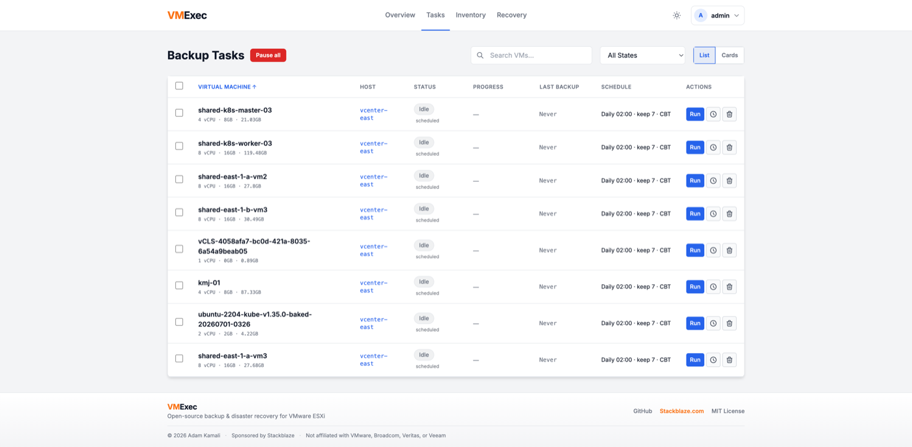
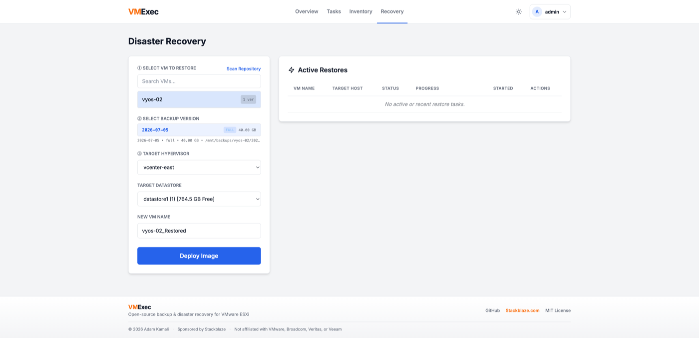

<p align="center">
  <strong style="font-size:2rem"><span style="color:#F97316">VM</span><span style="color:#111827">Exec</span></strong>
</p>

<h1 align="center">VMExec</h1>
<p align="center"><strong>Enterprise-grade VM backup & disaster recovery for VMware ESXi</strong></p>
<p align="center">Built by <a href="https://github.com/stackblaze-adam">Adam Kamali</a> · Sponsored by <a href="https://stackblaze.com">Stackblaze.com</a></p>

<p align="center">
  
  
  
  
  
  
</p>

<p align="center">
  
</p>

---

## Protect every VM. Recover in minutes.

**VMExec** is a self-hosted backup platform for **VMware ESXi and vCenter** — no agents, no per-VM licensing, no vendor lock-in. Deploy on Docker or Windows Server, point it at your hosts, and start protecting workloads in minutes.

Agentless snapshots. Incremental backups. One-click restore. Built for teams who want Veeam-class capability without the enterprise price tag.

---

## Features

### 🔄 Incremental backups that save time and space
Capture only changed blocks with **VMware Changed Block Tracking (CBT)**. Full backups when you need them, fast incrementals every day — with automatic synthetic fulls to keep chains healthy.

### 📦 Compression built in
Shrink backup storage costs with **zlib-compressed deltas** and **gzip-compressed VMDKs**. Less disk, less bandwidth, same recovery confidence.

### 📅 Smart retention with GFS
Set it and forget it with **Grandfather-Father-Son** policies — keep daily, weekly, and monthly restore points automatically. Or use simple count-based retention if you prefer.

### 🛡️ True 3-2-1 backup strategy
Every backup can be **copied to a secondary target** — SMB share, NFS export, or S3 bucket. Your data lives in two places without a second product or manual scripts.

### ⚡ Fast, flexible storage
Write backups to **SMB/CIFS, NFS, or S3-compatible** storage (AWS, Wasabi, MinIO). Primary and secondary targets — your infrastructure, your rules.

### 🔁 Disaster recovery, simplified
Browse backups by VM, pick any restore point, and deploy to **any host or datastore**. See your full **backup chain timeline** before you restore — no guessing which incremental you need.

### 🖥️ vCenter & ESXi — both supported
Connect a **standalone ESXi host or vCenter Server**. One dashboard for your entire VMware estate.

### 🔐 Security by default
**HTTPS**, mandatory **MFA (TOTP)**, and **role-based access** (Admin / Operator / Viewer). Every user authenticated, every action auditable.

### 🔌 REST API for automation
Integrate with your stack via **REST API v1** — JWT sessions, long-lived API keys, and OpenAPI docs. Automate backups, triggers, and monitoring from CI/CD or scripts.

### 📊 Operations dashboard
Real-time **task progress**, **storage utilization**, and **backup health** at a glance. Pause all jobs globally when you need a maintenance window.

### 🎨 Modern web UI
Light, Dark, and Cyberpunk themes. Guided **setup wizard** for first-run. Schedule backups with flexible daily, weekly, and monthly rules — per VM.

---

## Quick start (Docker)

```bash
git clone https://github.com/stackblaze-adam/vmexec.git
cd vmexec

python init_db.py
docker compose up -d
```

Open **https://localhost:8000** (accept the self-signed certificate warning).

| | |
|---|---|
| **Username** | `admin` |
| **Password** | `admin` |

> Set up MFA on first login, then change the admin password under **Users**.

### Windows Server

1. Download the latest release from [Releases](https://github.com/stackblaze-adam/vmexec/releases)
2. Extract and run **`setup.bat`** as Administrator
3. Open **https://localhost:8000**

---

## Screenshots

<table>
  <tr>
    <td></td>
    <td></td>
  </tr>
  <tr>
    <td align="center"><em>Overview — backup health, storage & activity</em></td>
    <td align="center"><em>Tasks — schedules, CBT, and one-click runs</em></td>
  </tr>
  <tr>
    <td colspan="2"></td>
  </tr>
  <tr>
    <td colspan="2" align="center"><em>Recovery — pick a VM, version, and deploy anywhere</em></td>
  </tr>
</table>

---

## Architecture

```
┌─────────────────────────────────────┐
│              VMExec                 │
│  ┌──────────────┐  ┌─────────────┐  │
│  │  Web (API)   │  │  Worker     │  │
│  │  FastAPI     │  │  APScheduler│  │
│  └──────┬───────┘  └──────┬──────┘  │
│         └────────┬────────┘         │
│          ┌───────▼────────┐         │
│          │  SQLite (data/)│         │
│          └───────┬────────┘         │
└──────────────────┼──────────────────┘
                   │
        ┌──────────┴──────────┐
   ┌────▼────┐         ┌─────▼─────┐
   │ ESXi /  │         │ Primary & │
   │ vCenter │         │ secondary │
   └─────────┘         │ SMB/NFS/S3│
                       └───────────┘
```

---

## Configuration

All settings are in the web UI under **Settings**:

| Section | Description |
|---------|-------------|
| **Registered Hosts** | ESXi or vCenter credentials |
| **Target Storage** | Primary backup destination (SMB / NFS / S3) |
| **Engine** | CBT, compression, GFS retention, secondary copy, concurrency |
| **Email Alerts** | SMTP notifications per user/event |

---

## Requirements

- Python **3.11+** or Docker
- Network access to ESXi/vCenter on port **443**
- Backup storage: SMB share, NFS export, or S3 bucket
- **2 GB+ RAM** recommended

---

## Security

- Run `init_db.py` for a clean install — credentials and TLS certs stay in `data/` (gitignored)
- Change default credentials and enable MFA immediately
- Use a CA-signed TLS certificate in production

---

## Disclaimer

VMExec is an **independent** open-source project. It is not affiliated with, endorsed by, or sponsored by VMware, Broadcom, Veritas/Arctera (Backup Exec), Veeam, or any other backup vendor. VMware and ESXi are trademarks of Broadcom.

VMExec includes code from [NovaBak](https://github.com/haimtoledano/NovaBak) by [haimtoledano](https://github.com/haimtoledano), used under the [MIT License](LICENSE).

---

## License

MIT © [Adam Kamali](https://github.com/stackblaze-adam) · Sponsored by [Stackblaze.com](https://stackblaze.com)
